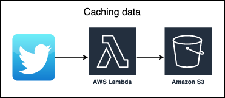
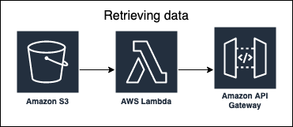

# Twitter cache and retrieve

This project caches the tweets of a user. Retrival is done through an API gateway.

When caching the tweets to S3, the Lambda is smart enough to know what Tweets it
has previously cached.

When retrieving, the Lambda simply returns the latest 5 tweets. This project was
created to help me learn VueJS. See the project
**[display-cache-website](https://github.com/alexhnguyen/display-cache-website)**.

## Caching



## Retrieving



```
$ curl https://at6igxnu04.execute-api.us-west-2.amazonaws.com/prod/
[{'author_id': 813286, 'screen_name': 'BarackObama', 'created_at': '2021-01-29T0
4:04:55', 'text': 'In her extraordinary career, Cicely Tyson was one of the rare
```

## Setup

To use Twitter's API, you need to get credentials from Twitter. Go to this page
and sign in

> https://developer.twitter.com/en/portal/projects-and-apps

Create a new project or application. Then generate the Twitter credential keys.

Then go to this page on AWS

> https://us-west-2.console.aws.amazon.com/lambda/home?region=us-west-2#/functions

Add the credentials as environment variables. By default, the environment
variables will be blank. We _could_ use secrets manager, but then we have to
pay for every request.
